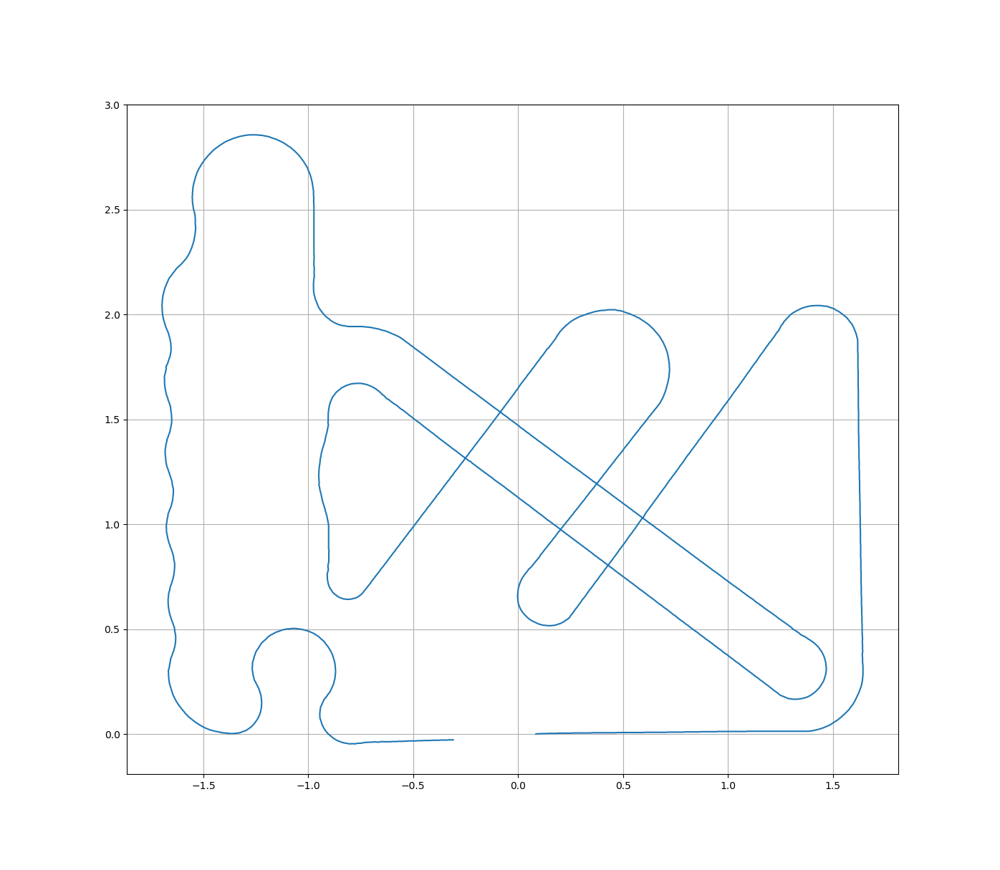

# robotrace_course

## 種類
* real : 実際にロボットを走行させて記録したデータ
* synthetic : NTFが公開している図面などをもとに作成したデータ

## フォーマット
### hoge.csv (syntheticのみ)
各区間について区間長と曲率を記録したもの．
```
#length[m], curvature[rad/m]
(区間長0), (曲率0)
(区間長1), (曲率1)
(区間長2), (曲率2)
...
```
### hoge_points.txt
ラインの軌跡を1cm間隔の点列として保存したもの．
```
x0 y0
x1 y1
x2 y2
...
```

plot_points.pyを実行することでファイルの中身を確認できます．
```
python plot_points.py (path to file)
```
実行例：

